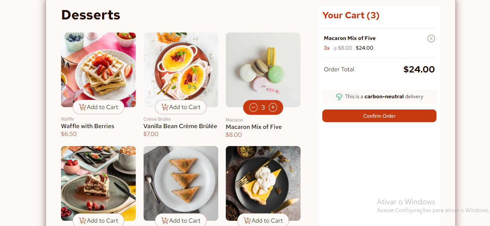

# Product list with cart solution



## Descrição Geral | General Description

This is a solution to the [Product list with cart challenge on Frontend Mentor](https://www.frontendmentor.io/challenges/product-list-with-cart-5MmqLVAp_d). I used JavaScript for most of the project to populate and edit the content in the HTML. This project doesn't use any frameworks. I built it using pure HTML, CSS, and JS.

Esta é uma solução para o [Desafio de Lista de Produtos com Carrinho no Frontend Mentor](https://www.frontendmentor.io/challenges/product-list-with-cart-5MmqLVAp_d). Usei em grande parte do projeto a linguagem JavaScript para preencher e editar o conteúdo no HTML. Neste projeto, não usei frameworks. Construi tudo com HTML, CSS e JS puros.

[Path to English Version](#english-version)
## Versão Em Português

## Índice

- [Visão Geral](#visão-geral)
  - [O Desafio](#o-desafio)
  - [Links](#links)
- [Meu Processo](#meu-processo)
  - [Construído Com](#construído-com)
  - [O Que Eu Aprendi](#o-que-eu-aprendi)
  - [Desenvolvimento Contínuo](#desenvolvimento-contínuo)
  - [Recursos Úteis](#recursos-úteis)
- [Autor](#autor)


### Visão Geral

#### O Desafio

Os usuários devem ser capazes de:

- Adicionar itens ao carrinho e removê-los
- Aumentar/diminuir a quantidade de itens no carrinho
- Ver um modal de confirmação de pedido quando clicarem em "Confirmar Pedido"
- Reiniciar suas seleções ao clicar em "Iniciar Novo Pedido"
- Ver o layout ideal para a interface dependendo do tamanho da tela do dispositivo
- Ver os estados de foco e hover para todos os elementos interativos na página

#### Links

- URL do Site ao Vivo: [GitHub Pages](https://gustaleao.github.io/product-list-with-cart-main/)

### Meu Processo

#### Construído Com

- Marcação HTML5 semântica
- Propriedades customizadas de CSS
- Flexbox
- CSS Grid
- Fluxo de trabalho com foco em desktop

#### O Que Eu Aprendi

Eu populava o HTML dinamicamente usando funções em JavaScript, algo que acabei de aprender em meu curso do [freeCodeCamp](https://www.freecodecamp.org/), e criei ID para escolher o elemento correto em um array dinâmico;

```js
const proudOfThisFunc = () => {
  // Acha o botão apertado pelo index e identifica a qual sobremesa pertence pelo seu valor, que é nome da sobremesa
  const verifyBtn = (e) => {
    const btns = document.getElementsByClassName("dessert_btn");
    btnArr = Array.from(btns);

    let i = btnArr.findIndex((btn) => btn == e.target);

    let indentifier = btnArr[i].getAttribute("value");
    console.log(indentifier);

    getDataTo(modifyCartList, indentifier);
  };
}
```

#### Desenvolvimento Contínuo

Quero refinar o uso de arrays dinâmicos e buscar dados para atualizações dinâmicas na UI (Interface do Usuário). O próximo passo que vou dar é aprender um framework CSS, para ter menos problemas em meus projetos futuros 🤣.

#### Recursos Úteis

- [PowerToys](https://learn.microsoft.com/pt-br/windows/powertoys/) - Isso me ajudou a alinhar textos no meu projeto.
- [Responsive Viewer](https://chromewebstore.google.com/detail/responsive-viewer/inmopeiepgfljkpkidclfgbgbmfcennb?pli=1) - Esta extensão do Google me ajudou a visualizar a responsividade em diferentes layouts de dispositivos.

### Autor

- Frontend Mentor - [@GustaLeao](https://www.frontendmentor.io/profile/GustaLeao)
- LinkedIn - [@Gustavo Leão](https://www.linkedin.com/in/075leao/)


## English Version

## Table of contents

- [Overview](#overview)
  - [The Challenge](#the-challenge)
  - [Links](#links)
- [My Process](#my-process)
  - [Built With](#built-with)
  - [What I Learned](#what-i-learned)
  - [Continued Development](#continued-development)
  - [Useful Resources](#useful-resources)
- [Author](#author)

### Overview

#### The Challenge

Users should be able to:

- Add items to the cart and remove them
- Increase/decrease the number of items in the cart
- See an order confirmation modal when they click "Confirm Order"
- Reset their selections when they click "Start New Order"
- View the optimal layout for the interface depending on their device's screen size
- See hover and focus states for all interactive elements on the page

#### Links

- Live Site URL: [GitHub Pages](https://gustaleao.github.io/product-list-with-cart-main/)

### My Process

#### Built With

- Semantic HTML5 markup
- CSS custom properties
- Flexbox
- CSS Grid
- Desktop-first workflow

####  What I Learned

I populate the HTML dinamically using functions on the JavaScript, thing I just have done in my course from [freeCodeCamp](https://www.freecodecamp.org/), and make ID to choose the correct element in a dinamic array;

```js
const proudOfThisFunc = () => {
  // Acha o botão apertado pelo index e identifica a qual sobremesa pertence pelo seu valor, que é nome da sobremesa
// Find clicked button by index and identify wich dessert it belongs by your value, what is the name of the dessert
  const verifyBtn = (e) => {
    const btns = document.getElementsByClassName("dessert_btn");
    btnArr = Array.from(btns);

    let i = btnArr.findIndex((btn) => btn == e.target);

    let indentifier = btnArr[i].getAttribute("value");
    console.log(indentifier);

    getDataTo(modifyCartList, indentifier);
  };
}
```

#### Continued Development

I want to refine the use of dinamic array and fetch data for dinamic updates UI (User Interface). The next step i will take is learn a CSS framework, for less trouble in my futures projects 🤣.

#### Useful Resources

- [PowerToys](https://learn.microsoft.com/pt-br/windows/powertoys/) - This helped me align texts in my project.
- [Responsive Viewer](https://chromewebstore.google.com/detail/responsive-viewer/inmopeiepgfljkpkidclfgbgbmfcennb?pli=1) - This Google extension helped me visualize responsiveness in different device layouts.

### Author

- Frontend Mentor - [@GustaLeao](https://www.frontendmentor.io/profile/GustaLeao)
- LinkedIn - [@Gustavo Leão](https://www.linkedin.com/in/075leao/)
